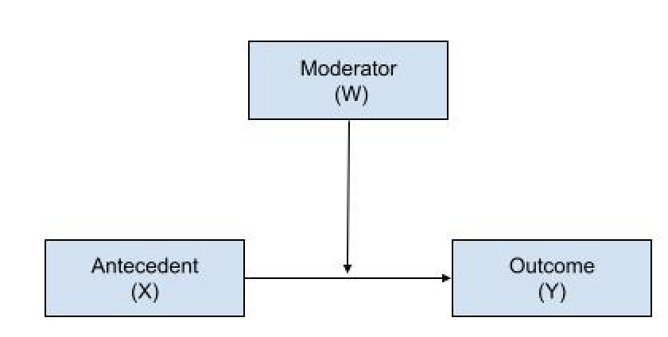
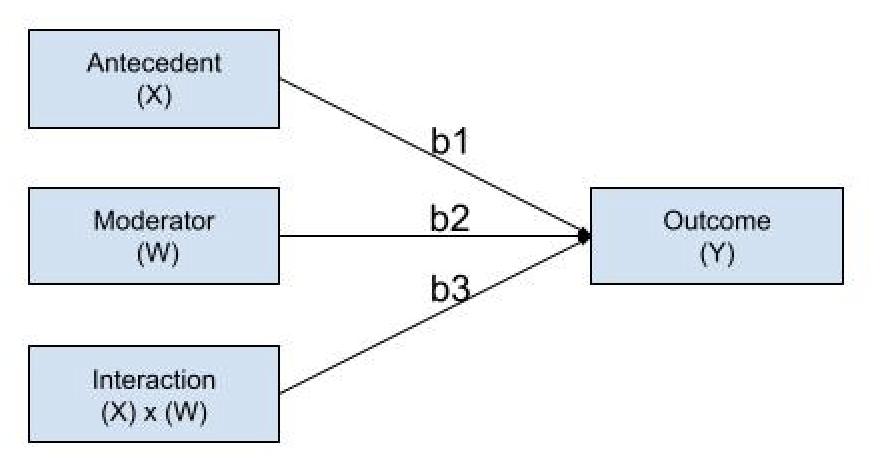
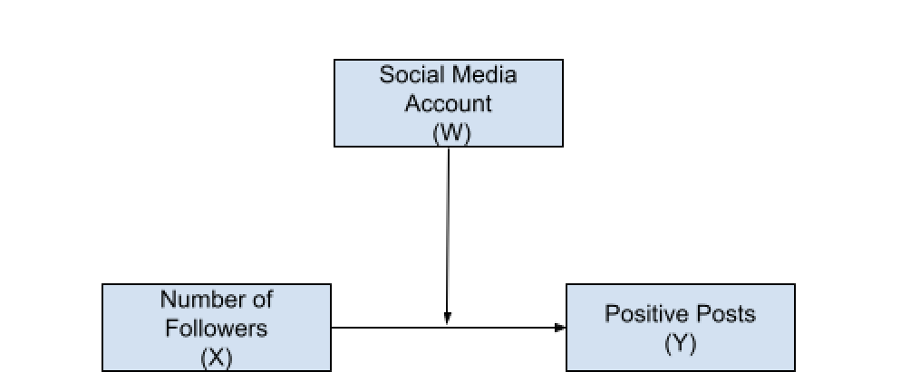
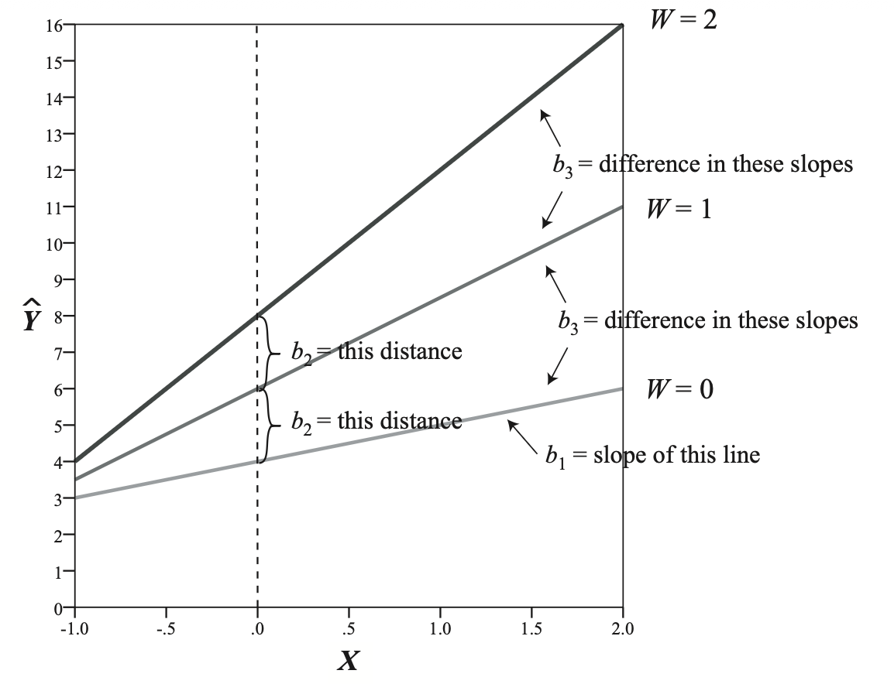

# Overview

This module consists of two parts. In part one, well will discuss and review moderation models using Hayes (2020) ProcessR Macro and base R. Using simulated data inspired by multiple social media studies and Dr. Nancy Collins *Introduction to Mediation Analysis*, we will explore the relationship between the number of social media followers and positive posts considering social media platform as a moderator in part one and overall levels of stress as mediator in part two.

# Packages

```{r Packages}
#| message: false
library(dplyr) #use this package with ggplot to create graphs and summarize data 
library(psych) #use this package for descriptive statistics
library(skimr) #use this package for descriptive statistics 
library(readr) #use this package for reading in a csv file 
# install.packages("interactions") copy and paste into your console- 3rd panel 
library(interactions) #use this package to create interaction in ggplot
library(ggplot2) #use this package to create moderation plots 
```

```{r DataGeneration}
#| echo: false
#| eval: false
# Set seed for reproducibility
set.seed(123)
# Set sample size to 300
n <- 300
# Generate Subject Number
subnum <- 1:n
# Generate Explanatory Variables the number of follower
Followers <- round(runif(n, 2, 200)) 
#SMA Accounts with a sample size of 300 set by n and values ranging from 0 1, with 0 being not tiktok account, and tiktoc equak 1 
SMAccount <- rbinom(n, 1, 0.5)    
# Generate Mediators (M1) with Asymmetrical Moderation
# M1: Cortisol
Cortisol <- 10 + 
            ifelse(SMAccount == 0, 0.6 * Followers, -0.1 * Followers) + 
            rnorm(n, 0, 1.2)
Cortisol <- pmax(1, pmin(15, Cortisol))
# Generate Dependent Variable (Y): Immune Health
PosPost <- 45 - (1.8 * Cortisol) + rnorm(n, 0, 4)
PosPost <- pmax(0, pmin(100, PosPost))
# Create the Data Frame (subnum added as the first column)
df <- data.frame(subnum, Followers, SMAccount, Cortisol, PosPost)
# This is me saving the csv file 
write.csv(df, "socialmedia.csv", row.names = FALSE)
```

# Define Moderation

Goal: According to Hayes, the purpose of a moderation model is to identify the "boundary conditions of an association between two variables".

-   Determine how a third variable, W (the moderator), affects the relationship between an focal antecedent variable, X, and a response variable, Y.

-   In other words, there is a conditional effect on the relationship between x and y. The amount by which two cases that differ by one unit on X are estimated to differ on Y.



-   Moderation is just an other term for statistical interaction. The analytic procedure is a regression-based procedure that is mathematically similar to ANOVA.

-   Estimate the number of positive posts we regress the antecedent variable, moderator, and the product of the antecedent variable and moderator.

$$\hat{Y} = i_Y+b_1X_{1}+b_2W_{1}+b_3X_{1}W_{1}+e_Y$$ 

-   Examine whether the strength or direction of the relationship between the number of followers and positive posts depends on whether the subject posts on TikTok or non-TikTok users, as shown in the conceptual model below.



-   We examine how the number of followers varies across social media platforms. Another way we can convey this relationship is that for different social media platforms, the number of followers impacts the number of positive posts differently.

$$\hat{Y}_{PositivePost} = i_Y+b_1X_{Followers}+b_2W_{Account}+b_3X_{Followers}W_{Account}+e_Y$$

## Interpretations of Regression Coefficients

How to interpret $b_1$?

-   That is, $b_1$ quantifies how much two cases that differ by one unit on $X$ but with $W = 0$ are estimated to differ on Y. $b_1$ represents the association between $X$ and $Y$ conditioned on $W = 0$.

-   b1 is the slope of the line linking X to Y when $W = 0$

-   A one unit difference in the number of followers are estimated to differ by $b_1$ in the number of positive posts for non-TikTok users.

-   It is similar to a simple effect in ANOVA

How to interpret $b_2$?

-   $b_2$ is the conditional effect of $W$ on $Y$ when $X = 0$

-   how much two cases that differ by one unit on $W$ are estimated to differ on $Y$ conditioned on $X= 0$.

-   TikTok and Non-TikTok users are estimated to differ by $b_2$ positive posts when someone has 0 followers.

How do you interpret $b_3$?

-   Divergence or degree of non-parallelism in all slopes in the moderator, or the difference in slopes. \* One-unit change in $X$, antecedent variables, results in a change in $Y$ that depends on $W$.

-   The larger the absolute value of $b_3$ the larger the divergence between the slopes between values of moderator.

##  Considerations

-   Using Process macro is not necessary, but is a popular approach because code is reduced to specifying the role of variables.
-   Process uses listwise deletion, where an entire observation or case is removed if it contains any missing values across selected variables.
-   Moderation is symmetrical, where the antecedent can be expressed as the moderator and moderator as the antecedent.
-   b3 will be different from zero even when X’s effect on Y is independent of W.
-   If XW are in the model, X and W should be included as well, even if b1 and b2 are not statistically significant. Excluding X or W will bias the estimate of the moderation of X’s effect by W.

# Example of Moderation

## Research Questions and Hypotheses:

-   RQ1: Does a social media account (TikTok user vs. non-TikTok user) moderate the relationship between the number of followers and the number of positive posts?

    -   HO: The relationship between the number of followers and positive posts does not depend on whether the social media user is a TikTok user or a non-TikTok user.

    -   HA: The relationship between the number of followers and positive posts is stronger for TikTok users versus non-TikTok users.

## Calling in the Data and Exploring

Always evaluate the raw data. Ensure that your data is tidy, with each row representing an observation and each column a variable. Evaluate the distribution of the variables and identify and handle missing data.

```{r ReadingData}
#Read in the data using the read_csv function 
SM_df <- read_csv("socialmedia.csv")
#Using the skim function in skimr package we can get a table of descriptive statistics 
skim(SM_df)
#Using the describe function in the psych package to also explore the data 
describe(SM_df)


```

Find the descriptive information of variables given some group data for our example.

```{r Summarise}
# We are using the SM_df and grouping by TikTok vs non-TikTok users. We are going to summarise using the summarise function across variables that are numeric.Specifically, we want to list using the list function, where mean is labeled as the mean, standard deviation is labeled as the sd, minimum value is labeled as the minimum, and maximum value is labeled as max.
summary_all <- SM_df %>%
  group_by(SMAccount) %>%
  select(-c(subnum,SMAccount)) %>% 
  summarise(across(
    where(is.numeric), 
    list(mean = mean, sd = sd, min = min, max = max), 
    na.rm = TRUE, 
    .names = "{.col}_{.fn}"
  ))

summary_all
```

## Center X and W

-   Using dplyr you can mean-center variables to help with the interpretation of coefficients.
-   Mean center suggests that each value of the variable is subtracted by its mean, which will provide the distance away from the variables mean.
-   Centering your data will change the $b_1$, estimates the effect of $X$ on $Y$, when $W$ = 0.However, all other coefficients will remian the same

```{r MeanCentering}
# Use the mutate function to change or mutate variables 
# Use the across function if we want to change both x and w. 
# Use the tilde (~) and . to mean all values of the given variable minus the mean .
# in the case you have missing data use all values except those that are missing using the na.remove function. 
# the .name provides the set us of the column names, which will start with the orginal column name_c for center
SM_df <- SM_df %>%
  mutate(across(
    c(Followers), 
    ~ . - mean(., na.rm = TRUE),
    .names = "{.col}_c"
  ))
```

## Coding Techniques for Running Moderation Model

### Use the linear model function (lm)

-   The response variable, Y, is regressed on the antecedent variable (X), moderator (W), and their interaction.
-   An interaction can be specified by multiplying X and W using the asterisk symbol (\*) between both.

```{r LMModeration}
#Base R all in one line approach 
summary(lm(PosPost~Followers_c+SMAccount+Followers_c*SMAccount,data= SM_df))
```

### From Dr.Nancy Collins talk on Using the PROCESS macro

-   Let's run the moderation again using the **PROCESS macro** in R.

-   You will need the `process.R` script provided by [Andrew Hayes](https://www.processmacro.org/index.html).

-   Unlike standard R packages, PROCESS is a custom function you must "source" into your environment first.

#### Preparation: Load PROCESS into R

-   Make sure the `process.R` script file is in your current working directory

-   Run this script file, do not change anything in it!

-   Be patient, it may take a minute or two to run

-   Once the script finished, the `process` function will now be available for you to use

```{r ProcessR}
# Source the PROCESS macro function
source("process.R")
```

```{r ModerationProcessR}
process (data=SM_df,y="PosPost",x="Followers_c",w="SMAccount",model=1,jn=1,
plot=1)
```

## Visualizing Moderation for R

```{r VisualizingR}
#Ensure that social media accounts are set to factors for the graph 
SM_df$SMAccount <- as.factor(SM_df$SMAccount)

#I rerun the model with the factor social media variable 
model <- lm(PosPost ~ Followers_c * SMAccount, data = SM_df)
# using the interactive plot function 
# State the model object name 
#  pred = Give the predictor variable/antecedent
# modx = give the moderation 
#plot.points = TRUE adds raw data points
#interval = TRUE adds confidence bands with their width set to 95
interact_plot(
  model,
  pred = Followers_c,
  modx = SMAccount,
  plot.points = TRUE,
  interval = TRUE,
  int.width = 0.95,
  x.label = "Mean-centered Followers",
  y.label = "Predicted Positive Posts",
  legend.main = "SMAccount"
)
```

## Interpretation of Findings

$b_2$

-   The regression coefficient for account type is $b_2=$ 22.58 and statistically different from zero $(p < .001)$.

-   The sign is positive, suggesting that among TikTok users, the relationship between the number of positive posts and zero followers is stronger than that of non-TikTok users.

-   how much two cases that differ by one unit on $W$ are estimated to differ on $Y$ conditioned on $X= 0$.

$b_3$

-   The regression coefficient for the product between TikTok user account holders and the number of followers is $b_3$ = 0.068. This coefficient quantifies how the effect of the number of followers on the number of positive posts changes as the account type changes.

-   $b_3$ is statistically different from zero, meaning that the effect of the number of followers on the number of positive posts depends on whether the social media user is a TikTok user versus non-TikTok social media users

-   More specifically,the relationship strength between positive posts and the number of followers “increases” by 0.068 units, between TikTok and non-TikTok users, meaning that this effect moves right on the number line toward larger values.

## Probing the interaction

-   Probing is a post-hoc approach to evaluating the interaction.

-   The post-hoc inferential test establishes where in the distribution of the moderator the antecedent variable,X, has an effect on response variable, Y, that is different from zero and where it does not.

-   PROCESS uses a pick a point approach, which can be referred to as analysis of simple slope.

-   According to Hayes probing is a procedure that involves selecting a value or values of the moderator W, calculating the conditional effect of X on Y at that value or values, and then conducting an inferential test or generating a confidence interval.

## Interpreation of the Probing the interaction

-   Probing the interaction suggests that the type of social media account appears to have a statistically significant effect on the strength of relationship between the number of followers and the number of positive posts. Specifically among non-TikTok users the there was no statistically significant effect of the number of followers on positive posts $(\theta_{XY}|W=0)= 0.0069, t(298) = 1.0530,p = 0.2932$, there was for TikTok users with $(\theta_{XY}|W=1)= 0.075, t(298) = 10.8497, p < 0.000$
